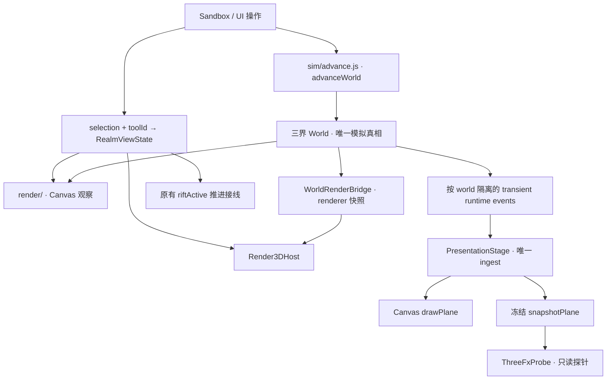

# ARCHITECTURE · 工作区与模块地图

事实核对：2026-09-30，Render3D M2-A final cleanup。当前阶段以 [ROADMAP](./ROADMAP.md) 为准；本轮没有 M2-B 实现。

## 1. 工作区归属

根目录是唯一开发、运行、测试和打包入口，直接关联 `sjh20016/inkbox`。Git 仓库不等于 dist 运行包。
发布包的精确清单由 [inkbox-package.mjs](./scripts/inkbox-package.mjs) 的 FILES / DIRECTORIES 定义。

| 路径 | 用途 | Git | dist |
| --- | --- | --- | --- |
| `inkbox.html`、`index.html`、`game.html`、启动批处理 | 游戏入口与跳转 / 启动 | 是 | 是 |
| `src/inkbox/` | 唯一活跃源码 | 是 | 是 |
| `vendor/three/` | 固定版本浏览器运行时与许可证 | 是 | 是 |
| `scripts/inkbox-*.mjs`、`scripts/cdp.mjs` | npm 命令及浏览器驱动；精确范围看 package.json / 打包清单 | 是 | 清单所列文件 |
| `scripts/_*.mjs` | D8 / M1 历史一次性研究探针 | 是 | 否 |
| `.github/workflows/`、`tests/README.md` | 门禁与测试说明 | 是 | 是 |
| `剧情文案素材/` | 活跃文案资产；00 册为接线约束 | 是 | 是 |
| `美术素材/` | 163 张 PNG、生成器、说明；Render3D 尚未接线 | 是 | 否 |
| `reports/release/render3d-m2a/` | 已发布的正式 M2-A 截图与 JSON | 是（日志除外） | 是 |
| 其他 `reports/` 输出 | 本机探针、日志、发布核验；CI 证据由 Actions artifact 保存 | 否 | 否 |
| `.workbuddy-ai/memory/` | 本地交接索引；历史记录压缩归档 | 否 | 否 |
| `.local-backups/` | 经校验的原工程 / Git 历史 / 清理备份 | 否 | 否 |
| node_modules、dist | npm 安装与构建产物 | 否 | 不嵌套收录 |

旧 V3/V4 的 `src/main.js`、demo、`scripts/v*` 不在当前工作树；需要考古时查 Git 历史，不把根目录跳转页误认为旧游戏。
根目录的旧阶段委托书与报告保存当时范围 / 证据，长期方向文档保存设计目标，均不能重新授权已完成的工程。
本地 MEMORY 只链接正式文档；发布包不依赖本地记忆或另一个发布目录。

## 2. 模拟与表现数据流



`sim/advance.js` 定义完整世界游戏日时钟；Sandbox.advanceDays 接入游戏，完整世界回归复用同一推进函数。
`io/save.js` 保存模拟数据，selection / RegionMask / Stage / FX 不成为存档字段。
runtime event 不是历史账本；编年史与 milestone 仍以 world.record 为准。
表现层不抽模拟 RNG，不反写实体 / 生态。`render3d/terrain/sculpt.js` 是显式编辑命令，受 Adapter 的凡间 / 关窗 / 关 Slab 守卫约束。

## 3. Render3D M2-A 结构

```text
render3d/Render3DAdapter.js       UI 接线、位面检视、地形编辑守卫
render3d/Render3DHost.js          1 GPU + 1 Scene + 1 CameraRig；Stage 生命周期
  stage/PlaneStage.js            每界一个 Group / bridge / profile 指定的 Layers
  stage/PlaneRenderProfile.js     集中位面语义；注入实体 derive strategy
  stage/WorldSetSnapshot.js       world / 子世界 / 尺寸 / buffer 身份变化
  picking/PlanePicker.js          可见地形和实例 raycast；instanceId → 实体
  view/RealmView3DPrototype.js    世界空间 Mask，可见 / 更新 / Layer 组合
  view/SlabPrototype.js           每边 ≤20 格的矩形面片与侧壁探针
  view/ThreeFxProbe.js            Presentation snapshot 的小型消费探针
  readers/riftViewModel.js        已有 sim 裂隙公式的只读入口
  shared/RenderOrder.js           集中渲染顺序
```

`Renderer3D.js` 只作兼容导出。PlaneStage 没有自己的 Camera / Scene / WebGLRenderer；root Group 可保留未来 pass 扩展口。
CameraRig 只持有 dimensions / coordinates；聚焦高程由 Host 按目标 Stage 计算。
各界数据解释集中在 profile 与 derive 函数，Layer 共享机制；dirty 分类是 height / water / type / veg，不给 World 新增 renderer dirty。
world 集合的身份、尺寸或地形数组变化会释放旧 Stage 集合并重建；相机与 GPU 保留。缺失子世界允许回退，尺寸不一致明确拒绝。

## 4. 视界接线与原型边界

`ui/realmView.js` 提供工具 / 位面映射与区域谓词；`ui/RegionMask.js` 包装不可变世界格 path / bounds / area。
`ui/realmViewState.js` 是统一派生入口，WeakMap 保持 Region 身份，并识别原地数据变化。
Canvas 把 Region 投影成 screen path 后 clip；Three 按 quad / entity 所在格中心过滤可见几何。
这些是两种表现同一 Region 的方法，规则与深度遮挡判据见 [VIEW_CONTRACT v2](./VIEW_CONTRACT.md)。

M2-A Mask 仅提交 Terrain + Entities，水 / 植被 / 聚落 / 标记 / 选中环未完成 Mask 支持；ThreeFxProbe 也不是完整 FX 移植。
一格边缘、跨边实体轮廓和高差侧向缺口是已声明局限；Slab 的矩形封边没有变成自由 Region 的 boundary skirt。
常驻 Stage、可见 Stage、实际更新 Stage 是不同成本，性能原始数据见 [performance.json](./reports/release/render3d-m2a/performance.json)。

## 5. 文档维护与提交边界

当前状态 / 方向由 ROADMAP 收口，契约只在 THREE_REALMS / VIEW_CONTRACT 成文，BACKLOG 只列未完事项。
HANDOFF 是短入口，STATUS 与阶段报告是历史；历史数据带阶段、日期和源码基线，不在多个记忆文件复制最新数字。
出现冲突时先核对用户最新范围、当前源码和执行证据，再修正文档；不要按旧记忆重新实现已有 Stage / Mask。

后续提交围绕可验收的变更拆分：架构、Mask、边界、Layer 与必要测试各自成包，文档可独立提交。
checkpoint `render3d-m2a` 指向 `f274def`；cleanup 另加提交，不重写这个聚合提交。
