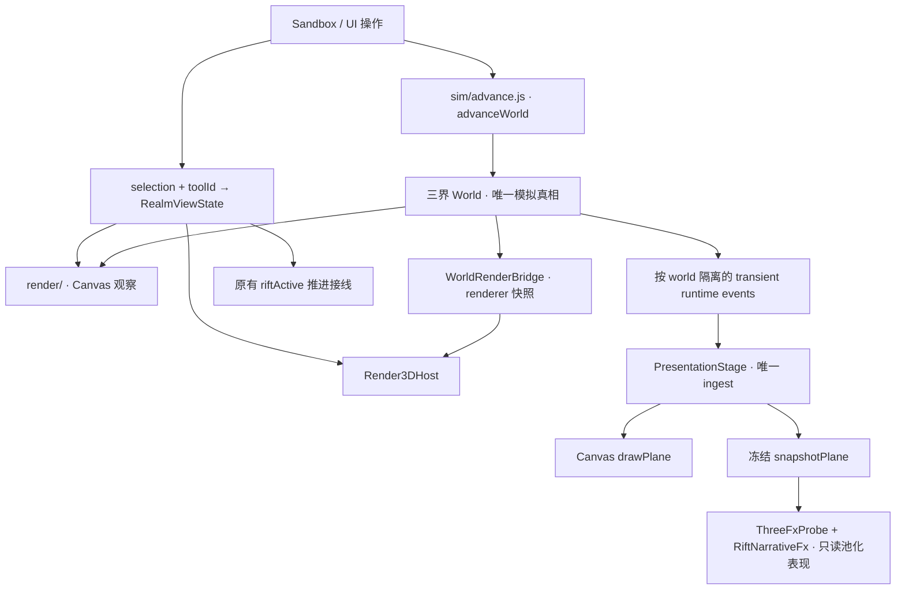

# ARCHITECTURE · 工作区与模块地图

## Current Truth · 2026-10-08

稳定模块地图以当前 GitHub main 为基线；当前正式阶段为 M2-C2E，工程接入已完成。产品主线、实验分支、归档 tag 与本地部署规则见 [HANDOFF](./HANDOFF.md)。阶段时间线见 [ROADMAP](./ROADMAP.md)，未完成事项见 [BACKLOG](./BACKLOG.md)。 下方阶段性叙述中标为“当前”的内容属于对应日期快照。

报告策略：保留 C2C、C2D、C2D.1、C2E 的阶段证据；M2-C 只保留正式 pilot 样本及核心机器可读证据。完整重复日志不作为 release 长期资产。

---
### 当前模块责任增量（M2-C2E）

- `terrain/topology` 与 `ElevationField` 共用 v2 网格对角 / 插值；v1 对角规则仍作为显式兼容路径。
- `WaterLayer` 持有湿域裁切、水岸和世界边缘水帘；`TerrainSideLayer` 只封完整世界外缘。世界侧壁参与拾取遮挡。
- `terrain/sculpt` / `TerrainStroke` 管理显式笔划事务与 Undo/Redo；写入仍经既有 World 地形数组，不引入第二套地形真相。
- `worldGeneration` 负责版本化地貌 / seed 生成；`core/mapAccess` 计算访问范围，World `mapProgress` 保存进度。`AccessGeometry` 把访问几何与既有 Realm Region 几何组合，不改变 `RealmMask` 的身份职责。
- Host 将访问权限传给 Canvas 与 Three；两种 renderer 共用权限语义。世界完整预生成，渐进开放控制可访问区域，不是 chunk streaming。

模块边界与详细实现见 [C2E 实现报告](./M2C2E_IMPLEMENTATION_REPORT.md)；性能 / 容量限制见 [C2E 就绪报告](./M2C2E_READINESS.md)。

---

2026-10-06 · 阶段记录：**M2-C2B Pass 1 已在主线 `e0a851c` 完成远端封板，第一代正式资产生产体系成立。**Push CI [37224093479](https://github.com/sjh20016/inkbox/actions/runs/37224093479)、手动 Windows Browser / C2B 矩阵与 soak [37224107941](https://github.com/sjh20016/inkbox/actions/runs/37224107941)、800 年 Nightly [37233858438](https://github.com/sjh20016/inkbox/actions/runs/37233858438) 均成功。M2-C2C Meaningful Geography 已本地完成，远端 Push 门禁以本轮 main 提交的 Actions 状态为准，手动 C2C Browser / Nightly 尚未运行；只呈现已有 World 语义，不扩展上界文明、幽冥城市或浮空岛拓扑。详见 [ROADMAP](./ROADMAP.md)。

历史基线：2026-10-04，Render3D M2-C2A.1 / M2-C2B0。当前阶段以 [ROADMAP](./ROADMAP.md) 为准；历史实现范围以各阶段报告为准。

## 1. 工作区归属

根目录是唯一开发、运行、测试和打包入口，直接关联 `sjh20016/inkbox`。Git 仓库不等于 dist 运行包。
发布包的精确清单由 [inkbox-package.mjs](./scripts/inkbox-package.mjs) 的 FILES / DIRECTORIES 定义。

| 路径 | 用途 | Git | dist |
| --- | --- | --- | --- |
| `inkbox.html`、`index.html`、`game.html`、启动批处理 | 游戏入口与跳转 / 启动 | 是 | 是 |
| `src/inkbox/` | 唯一活跃源码 | 是 | 是 |
| `vendor/three/` | 固定版本浏览器运行时与许可证 | 是 | 是 |
| `scripts/inkbox-*.mjs`、`scripts/cdp.mjs` | npm 命令及浏览器驱动；精确范围看 package.json / 打包清单 | 是 | 清单所列文件 |
| `scripts/_*.mjs` | D8 / M1 历史一次性研究探针 | 是 | 否 |
| `.github/workflows/`、`tests/README.md` | 门禁与测试说明 | 是 | 是 |
| `剧情文案素材/` | 活跃文案资产；00 册为接线约束 | 是 | 是 |
| `美术素材/` | 美术方向与生产参考；运行使用代码母版与有限色板 | 使用的设计资料 | 仅白名单方向文档/索引/委托书 |
| `reports/release/render3d-m2a/` | 历史正式 M2-A 证据 | 保留历史 | 仅 performance.json |
| `reports/release/render3d-m2c/` | 历史 M2-C 证据 | 保留历史 | 否 |
| `reports/release/render3d-m2c2a/` | C2A 代表图片与摘要 | 小集合；完整矩阵走 artifact | 仅 acceptance-summary.json / tree-gate.json |
| `reports/release/render3d-m2c2b0/` | 三界 summary 与 8 张代表 golden | 小集合 | 否 |
| `M2C2C_*REPORT.md`、`M2C2C_READINESS.md`、`M2C2C_VISUAL_ACCEPTANCE.md` | 当前工程、性能、视觉与就绪报告 | 是 | 是 |
| `reports/release/render3d-m2c2c/` | compact summary 与最多 8 张正常 Golden | 小集合；全量走本地 / artifact | 仅白名单 acceptance-summary.json；Golden 否 |
| `research/` | 只读空间关系 / 流量研究与脚本结果 | 研究资料 | 否；文档只写开发路径，不链接运行包缺失文件 |
| 其他 `reports/` 输出 | 本机探针、日志、发布核验；CI 证据由 Actions artifact 保存 | 否 | 否 |
| `.workbuddy-ai/memory/` | 本地交接索引；历史记录压缩归档 | 否 | 否 |
| `.local-backups/` | 经校验的原工程 / Git 历史 / 清理备份 | 否 | 否 |
| node_modules、dist | npm 安装与构建产物 | 否 | 不嵌套收录 |

旧 V3/V4 的 `src/main.js`、demo、`scripts/v*` 不在当前工作树；需要考古时查 Git 历史，不把根目录跳转页误认为旧游戏。
根目录的旧阶段委托书与报告保存当时范围 / 证据，长期方向文档保存设计目标，均不能重新授权已完成的工程。
本地 MEMORY 只链接正式文档；发布包不依赖本地记忆或另一个发布目录。

## 2. 模拟与表现数据流



`sim/advance.js` 定义完整世界游戏日时钟；Sandbox.advanceDays 接入游戏，完整世界回归复用同一推进函数。
`io/save.js` 保存模拟数据，selection / RegionMask / Stage / FX 不成为存档字段。
runtime event 不是历史账本；编年史与 milestone 仍以 world.record 为准。
表现层不抽模拟 RNG，不反写实体 / 生态。`render3d/terrain/sculpt.js` 是显式编辑命令，受 Adapter 的凡间 / 关窗 / 关 Slab 守卫约束。

## 3. Render3D M2-A 结构

```text
render3d/Render3DAdapter.js       UI 接线、位面检视、地形编辑守卫
render3d/Render3DHost.js          1 GPU + 1 Scene + 1 CameraRig；Stage 生命周期
  stage/PlaneStage.js            每界一个 Group / bridge / profile 指定的 Layers
  stage/PlaneRenderProfile.js     集中位面语义；注入实体 derive strategy
  stage/WorldSetSnapshot.js       world / 子世界 / 尺寸 / buffer 身份变化
  picking/PlanePicker.js          可见地形和实例 raycast；instanceId → 实体
  view/RealmView3DPrototype.js    世界空间 Mask，可见 / 更新 / Layer 组合
  view/SlabPrototype.js           每边 ≤20 格的矩形面片与侧壁探针
  view/ThreeFxProbe.js            Presentation snapshot 的小型消费探针
  readers/riftViewModel.js        已有 sim 裂隙公式的只读入口
  shared/RenderOrder.js           集中渲染顺序
```

`Renderer3D.js` 只作兼容导出。PlaneStage 没有自己的 Camera / Scene / WebGLRenderer；root Group 可保留未来 pass 扩展口。

M2-C 的 `render3d/art/ArtPass.js` 由 Host 持有，只协调已有 Layer 的材质和参数。`TerrainDataTextures` 随 TerrainMesh 生命周期，直接接已有 dirty 通道；`PigmentTerrainMaterial` 将纸、颜料与结构墨组合。`PilotAssets/PilotMaterial` 提供共享母版；`VisualScenarios` 是显式载入的开发证据模块，`ArtDebugPanel` 仅在 URL 开启时创建。没有第二套高程、Region 或 Renderer。
M2-C2A 的 `lod/PresentationBudget.js` 统一屏幕像素、迟滞与细节配额；Layer 持有按类别/LOD 固定的实例批次与身份映射。ArtPass 提供当前投影倍率，Host 只编排开关和统计；LOD 分配变化才上传矩阵。SettlementLayer 的凡间 HLOD 从真实屋舍派生，成员及完整包围范围跨 Region 时拒绝合并。全部高程和归属继续使用 Stage 的 ElevationField / RegionGeometry。
CameraRig 只持有 dimensions / coordinates；聚焦高程由 Host 按目标 Stage 计算。

C2C 的 `stage/GeographyFeatures.js` 定义六个只读开关 `sites` / `leylines` / `upperQi` / `netherYin` / `rifts` / `riftFx`；Host / PlaneStage 编排 enabled、production、Region、ArtView、LOD 与释放。`markers/WorldMarkerLayer.js` 只有一次世界事实 derive；SiteGeographyLayer、LeylineGeographyLayer、RiftWoundLayer 复用该输入，实际实例携带当前权威 id / 中心，Picker 回到当前 World 校验。Formation 8/4 个子实例分别贴地，仍只是一份 Site 身份；完整父 footprint 与 Region 判据不变。production off、资产缺失或地形拒绝时保留旧标记回退。

`art/ScalarFieldTexture.js` 由 Stage 持有，分别只读 Upper `qi` / Nether `veg` 到 R8 缓存；材质改变场的视觉强弱，不反写生态。持久 Rift 半径经已有 `readers/riftViewModel.js` 读取，短命 FX 只消费 PresentationStage 冻结 snapshot，不建立第二个 drain。没有新的 World kind、存档字段或 renderer 地形真相。

2026-10-06 本地实现及验收完成：11 模式 × 600 日 / 11 RNG / 49 save keys 一致，full SHA `4b37e9605591ef48e986833513a5f633da7ef28bc080f326dc884efe44abb498`；完整 23 对 GPU、600 lifecycle、6000 产品 RAF、两关键祖先及干净克隆通过。6000 帧的 200 段检查均保持 114 geometry / 10 texture / 16 program，这是实际资源观测。运行包 333 文件，约 8.8MB 目录 / 2.7MB ZIP，仅收 compact summary（≤256KiB），8 张 Golden 与 research 均留开发目录。七命令及 Leyline 定向门禁见 [测试索引](./tests/README.md)。手动 [c2c-browser.yml](./.github/workflows/c2c-browser.yml) 验当前阶段和 M2-B / C2B sample 两个关键祖先；[ci.yml](./.github/workflows/ci.yml) 保留完整历史 Browser 回归，普通 push 不启动 GPU。远端 Push 门禁以本轮 main 提交的 Actions 状态为准，手动 C2C Browser / Nightly 尚未运行，C2B e0a851c 的三个成功 run 仍只属于历史基线。
各界数据解释集中在 profile 与 derive 函数，Layer 共享机制；dirty 分类是 height / water / type / veg，不给 World 新增 renderer dirty。
world 集合的身份、尺寸或地形数组变化会释放旧 Stage 集合并重建；相机与 GPU 保留。缺失子世界允许回退，尺寸不一致明确拒绝。

## 4. 视界接线与原型边界

`ui/realmView.js` 提供工具 / 位面映射与区域谓词；`ui/RegionMask.js` 包装不可变世界格 path / bounds / area。
`ui/realmViewState.js` 是统一派生入口，WeakMap 保持 Region 身份，并识别原地数据变化。
Canvas 把 Region 投影成 screen path 后 clip；Three 按 quad / entity 所在格中心过滤可见几何。
这些是两种表现同一 Region 的方法，规则与深度遮挡判据见 [VIEW_CONTRACT v2](./VIEW_CONTRACT.md)。

M2-B 已扩展 Mask 到全部已有 Layer，M2-C 复用其判据。上界/幽冥不额外伪造凡间式水体和植被；ThreeFxProbe 沿用既有 Presentation snapshot。
一格边缘、跨边实体轮廓和高差侧向缺口是已声明局限；Slab 的矩形封边没有变成自由 Region 的 boundary skirt。
常驻 Stage、可见 Stage、实际更新 Stage 是不同成本，最新实测见 [M2-C2A 性能报告](./M2C2A_PERFORMANCE_REPORT.md)，M2-A 历史数据保留在原阶段目录。

## 5. 文档维护与提交边界

当前状态 / 方向由 ROADMAP 收口，契约只在 THREE_REALMS / VIEW_CONTRACT 成文，BACKLOG 只列未完事项。
HANDOFF 是短入口，STATUS 与阶段报告是历史；历史数据带阶段、日期和源码基线，不在多个记忆文件复制最新数字。
出现冲突时先核对用户最新范围、当前源码和执行证据，再修正文档；不要按旧记忆重新实现已有 Stage / Mask。

后续提交围绕可验收的变更拆分：架构、Mask、边界、Layer 与必要测试各自成包，文档可独立提交。
checkpoint `render3d-m2a` 指向 `f274def`；cleanup 另加提交，不重写这个聚合提交。

## 三界表现单源与运行资产

`art/RealmStyleProfile.js` 为深冻结的三界颜色/材质单源，ArtPass 按 Stage.plane 派发至 terrain、water、trees、buildings、entities、角色 atlas、真实 Rift marker 与界缘；同屏背景按凡界留白，目标界只改所属材料。没有全屏 LUT 或 Scene Fog。上界/幽冥仅接入已有 terrain/entities/只读选择/FX，层不存在时不补假生态。

`vegetation/treeVariation.js` 只用 seed/cell 稳定 hash 产生五种既有树轮廓和颜色；`SettlementLayer` 的远景簇持有真实房屋成员，区域跨界簇不合并。界缘切换/关闭恢复非当前目标界 Raw 派生高程。详见 [Profile 规格](./REALM_STYLE_PROFILE_SPEC.md)。

角色运行包仅收录 mesh/data/materials/docs。编辑源和 preview 不入 dist；完整本地/Actions 截图与日志也不入包。打包阶段把指向排除资料的文档链接改为明确的“开发资料，运行包不附带”，源码文档保留原链接。

## M2-C2E 地形和访问边界（2026-10-08）

terrain/topology统一v2网格对角与ElevationField插值，v1原对角保持。WaterLayer提交World湿域裁切和外周水帘，TerrainSideLayer仅封完整世界外周；世界侧壁参与Picker遮挡。Stage.profile变化立即refreshGroundLayers，不另扫Bridge。

TerrainStroke是正式雕刻写边界：固定距离采样，height/water/riverBase去重before/after，canonical矩形按帧flush，Undo/Redo走同路径。main持有stroke期间隔离模拟且不补跑，不改变倍速。

worldGeneration配置v2生成，save显式可选generation/mapProgress。core/mapAccess只读访问策略，world/mapProgress只写进度；region/AccessGeometry组合访问与原RegionGeometry指定侧，真实Region仍只属于RealmMask。Host传播三界，Canvas/3D共用权限，闭区完整模拟。详见[M2-C2E实现](./M2C2E_IMPLEMENTATION_REPORT.md)。

WaterLayer独占节点与裁切scratch缓存（约32字节/格）：World dirty更新邻域，profile/world变更全量初始化，Region/style变更重建可见索引；legacy回切先同步，dispose/Host换世界释放。TerrainMesh仅在对角变化时重传拓扑索引。Undo/Redo写前对整笔height/water/riverBase预期快照作原子校验，后续模拟冲突会拒绝和清空历史。
