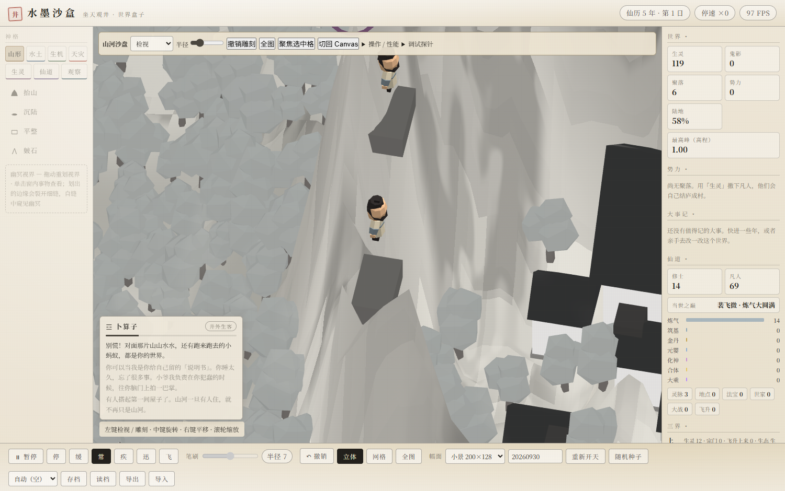
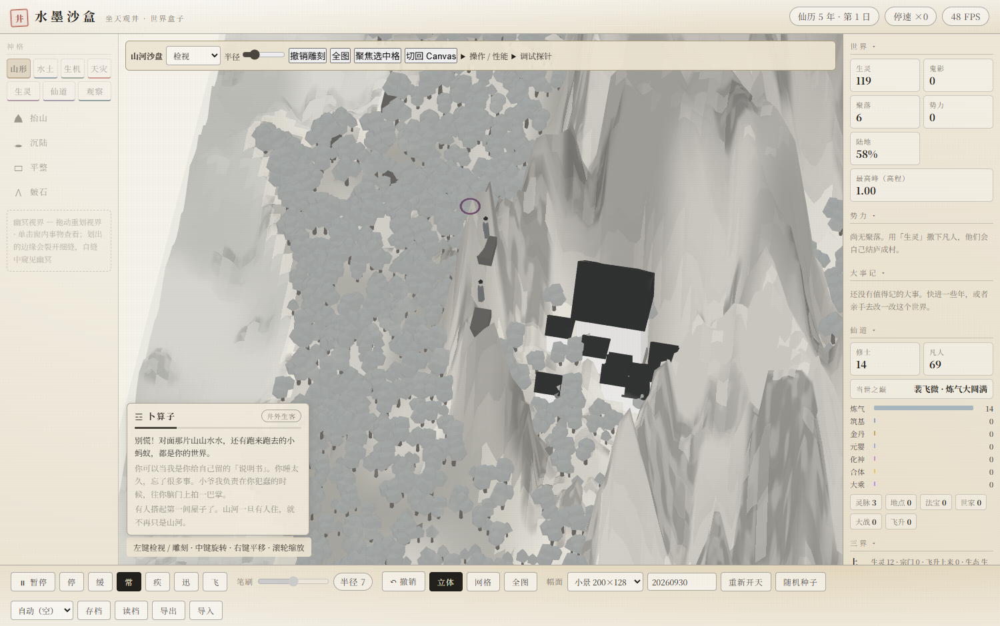
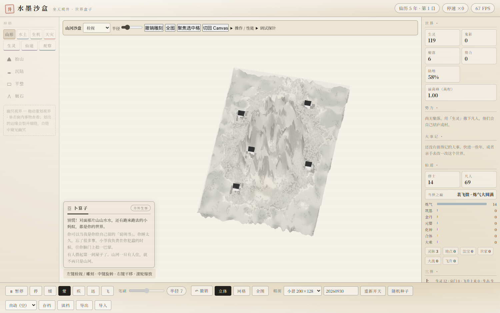
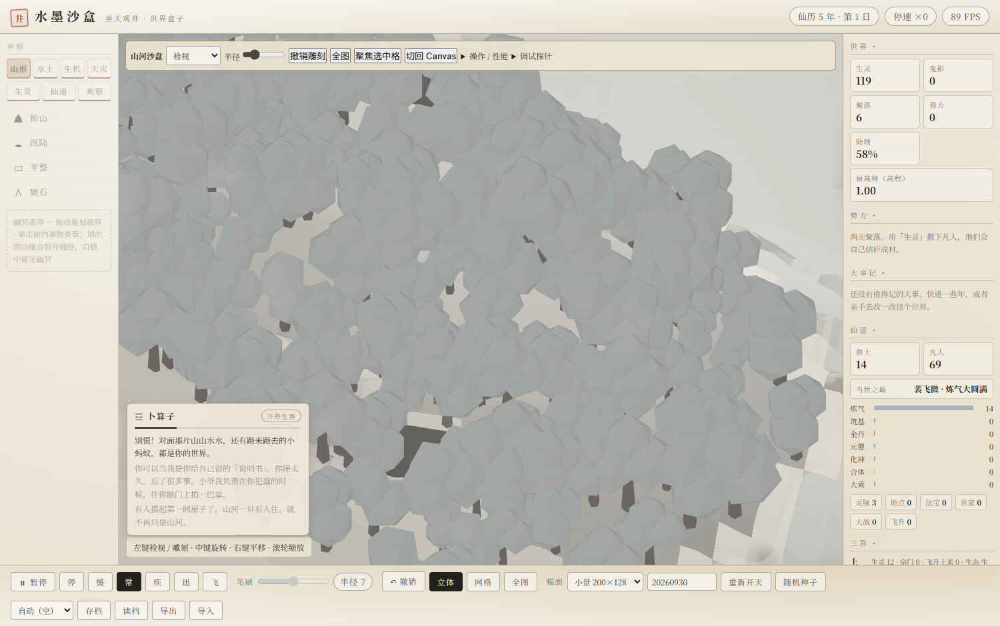
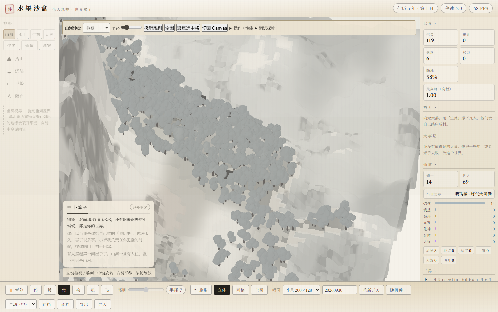
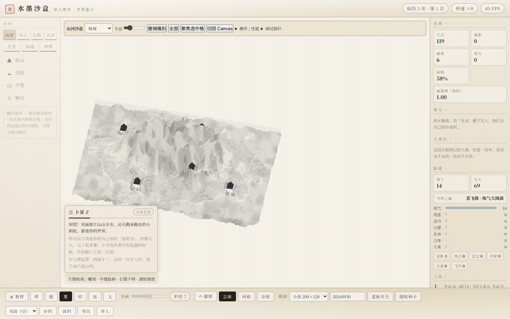
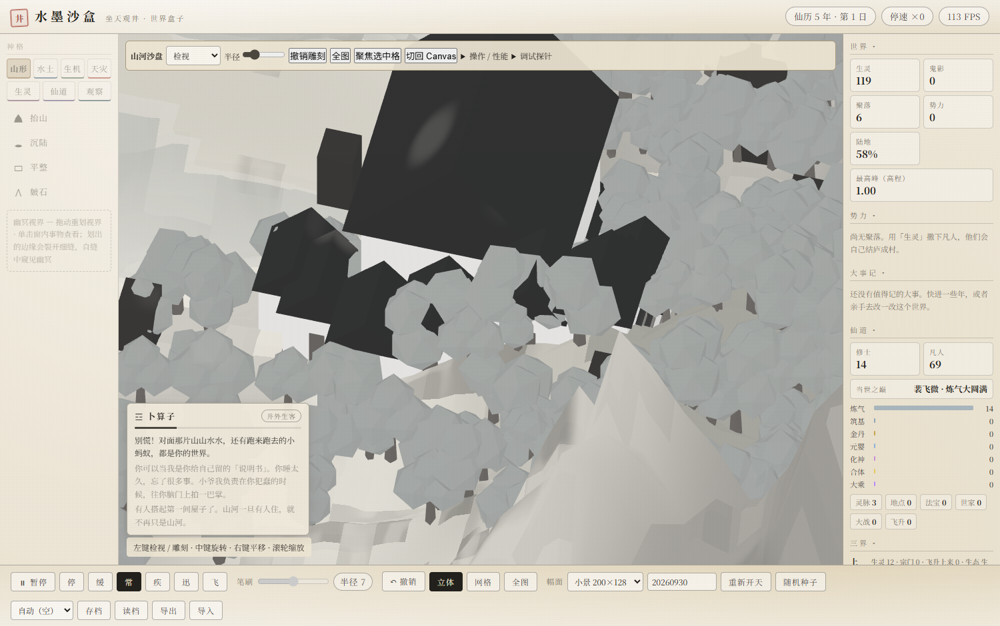
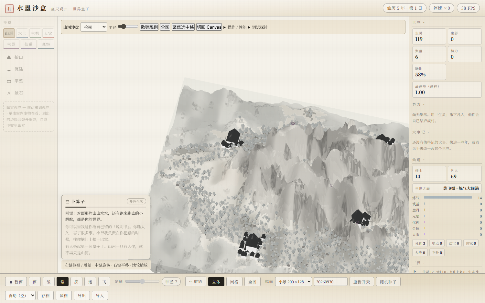
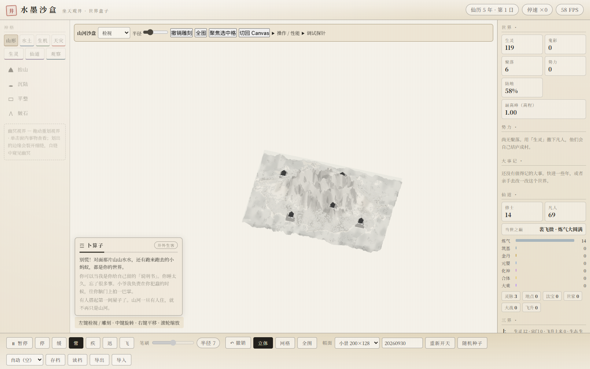
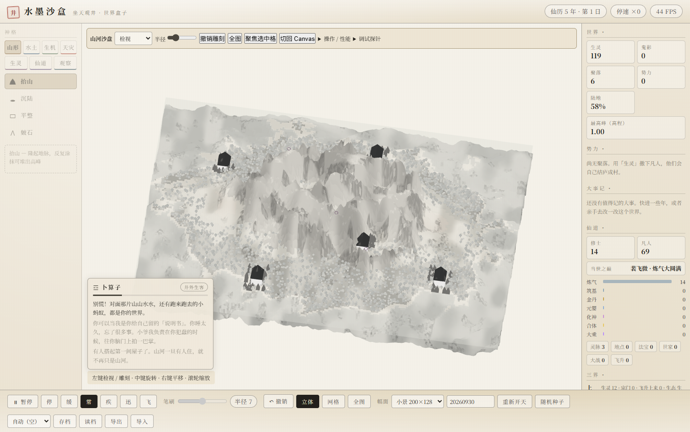

# M2-C2A 视觉与身份验收

2026-10-03。实际源指纹与环境见 [性能报告](./M2C2A_PERFORMANCE_REPORT.md)。使用VisualScenarios真实固定种子世界、deriveEntities/deriveVegetation/deriveSettlements数据，未新增演员、示意树或假房屋。代表图与逐图POI/相机/真实实例证明见 [poi-lod-screenshots.json](./reports/release/render3d-m2c2a/poi-lod-screenshots.json)。

## 角色近、中、远

选择真实修士id=34，距最近真实房屋6.88格。L0和L1从真实GLB/简化几何表面投影后，通过可见前景raycast与Host.pick恢复同一id。L2规则仍一对一identity，CLI三个档位均验证；远档只保留墨色轮廓，不承诺脸部/装备可读。

## 树与建筑

树使用真实密林POI且各档有实际可见批次表面证明。树L0保留树干与冠层，中档简化色块，远档闭合墨团；不退成相机一转就消失的单面卡片。建筑使用同一真实聚落，近景恢复独立屋舍，中景简化房体/屋顶，远景8-triangle屋顶质量HLOD。HLOD返回真实settlementId，近中档普通建筑沿用地形检视，划窗仅拾凡间地形。

## 总览与裁决

人工逐张检查九张POI图和Golden总览后，签收本轮工程原型。人物近景可见发型、头部和衣身；中景保持头身方向，装备细节已舍弃；远景仅剩很小的存在标记，身份正确不等于装备可读。密林近景有树干/冠层，中景保留连续林带，远景未出现整片林区消失。建筑近景有房体/屋顶，中景仍可见屋顶群，远景成为聚落质量；深色村落中心在俯视图中仍较显眼，沿用现有母版，不能据此称美术资产家族已完成。

| 类别 | 近 / 中 / 远实际zoom | 签收范围 |
|---|---|---|
| 同一修士id34 | 18 / 6 / 1 | 三档可见表面与真实身份；远档仅存在感 |
| 同一真实密林树 | 18 / 6 / 1 | 各档批次表面可见，林带连续 |
| 同一聚落 | 18 / 2 / 0.65 | 近中单屋、远HLOD及真实settlementId |

几何、身份和Region证据通过。跨档保留类别高度与脚底锚点，ghost透明/深度语义保留，迟滞避免阈值附近每帧切换。预算与LOD不修改World数量。已修复实例重分配后的包围球失效问题，防止空批次缓存导致中景模型可见却不能命中。

仍有限制：L1/L2是程序化轮廓母版，GLB的头发/装备不延伸到中远档；远景屋顶质量不表达每间房或坡地每个成员的独立高程；建筑中心/宗门未做完整HLOD；单体以格中心归属，轮廓跨格不等于几何裁切。仅可进入单家族受控试产，大量资产扩产要逐家族签收和多设备成本证据。

浏览器15项矩阵、600帧生命周期、6000帧耐久和模拟纯度均另见 [实施](./M2C2A_LOD_REPORT.md) / [性能](./M2C2A_PERFORMANCE_REPORT.md)；本文件没有替代这些检查。
