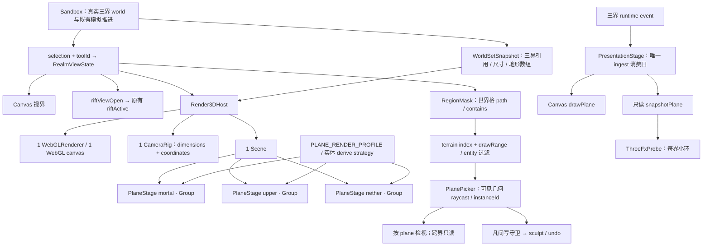
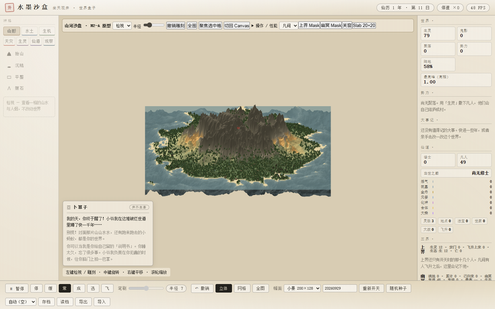
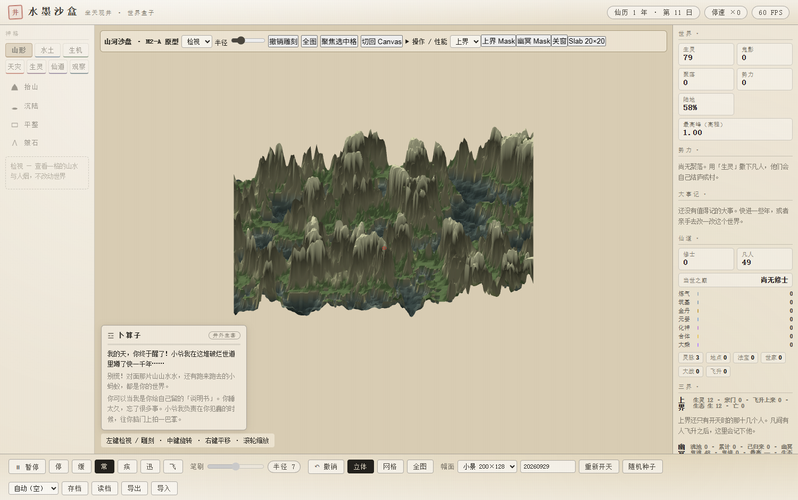
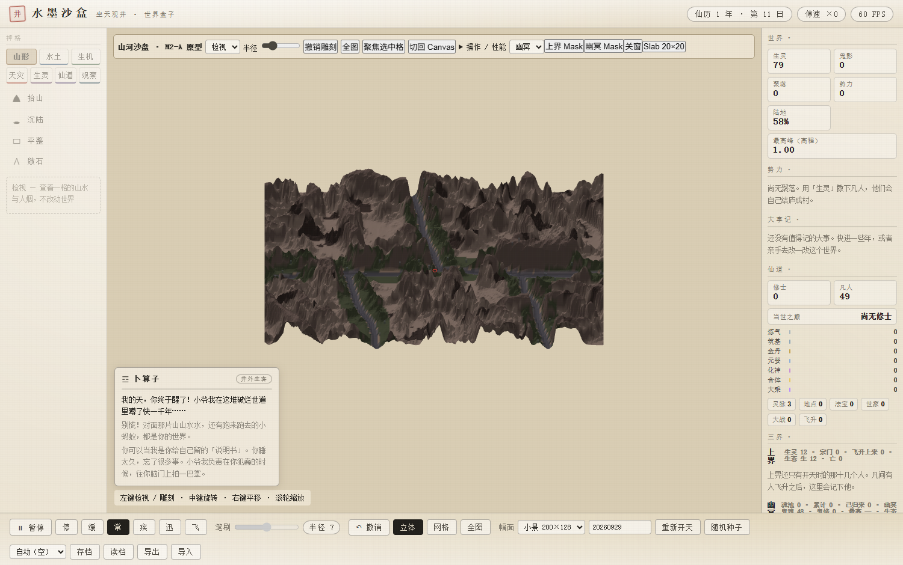
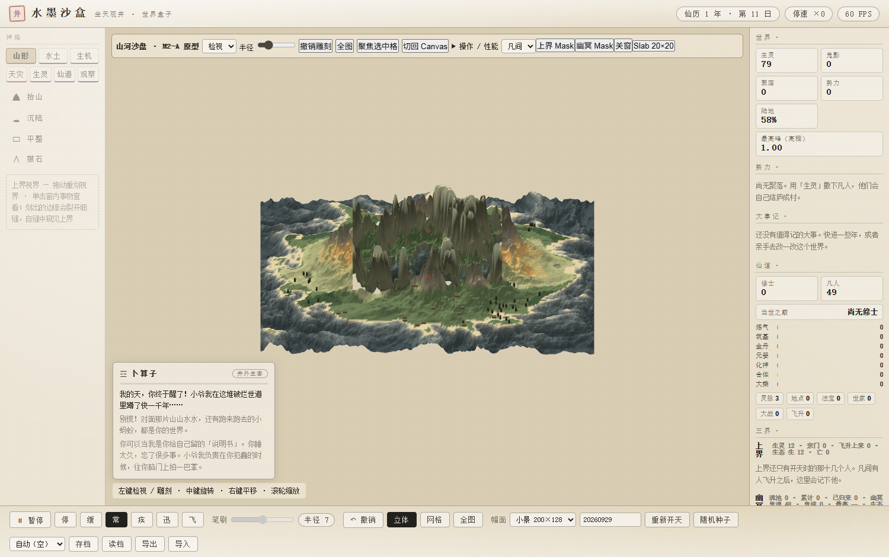
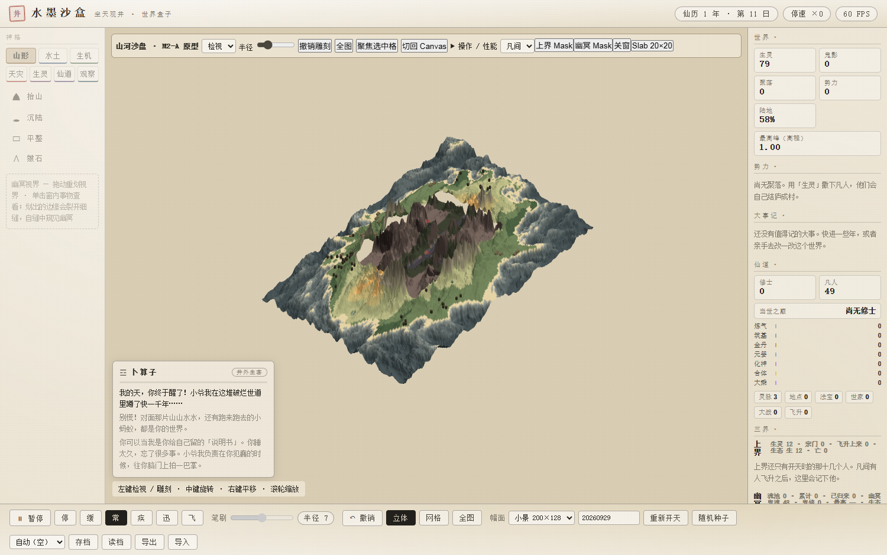
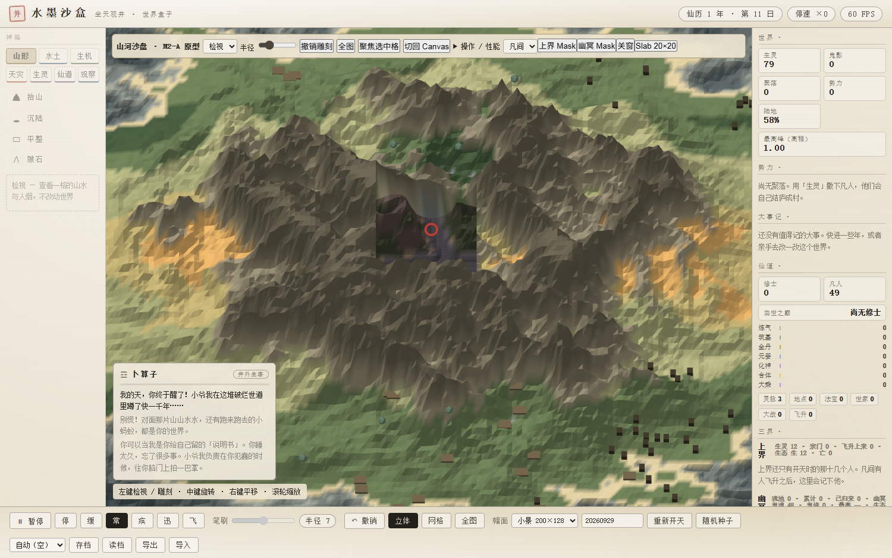

# 坐天观井 · Render3D M2-A 架构原型工程报告

日期：2026-09-30。基线：`main` 的 `b9f9f12`。范围依据同目录《坐天观井 · Render3D M2-A 架构原型工程委托书》。本阶段交付多位面架构与两个有限原型，不包含 M2-B、完整三界美术或 D8-G UI。

## 1. 最终架构



`Renderer3D.js` 保留兼容导出，实际宿主位于 `Render3DHost.js`。Stage 只有 Group，没有自己的 Scene、Camera 或 WebGLRenderer，未来仍可将 root 挂入 RenderTarget pass。

## 2. 实施内容与边界

| 工程包 | 实现 |
| --- | --- |
| A1–A3 | Host 管 GPU、相机、主 Scene、Stage 注册、生命周期和汇总；PlaneStage 管一个 world、bridge 和 profile 指定的 Layers |
| A4、A11 | 实体渲染仍按类别 InstancedMesh；各界 derive 入口只看当前 world 容器，不根据 ID 推断位面。凡间 wraiths 保留在凡间 |
| A5–A6 | 三界 w/h、size 与地形数组长度进入坐标契约断言；CameraRig 不保存完整 world，聚焦高程由 Host 提供 |
| A7、A15–A16 | pick 返回 plane/x/y/worldPoint/stage；实例命中额外返回 entityId，并按实例源坐标取格。上界、幽冥复用 realmInspector，不能写凡间 selected |
| A8 | Canvas、Three、riftViewOpen 共用 getRealmViewState；RegionMask 复制世界格 path，缓存稳定身份并识别原地路径变更 |
| A9 | PresentationStage 仍在 Sandbox.update 中唯一 ingest；snapshotPlane 返回隔离且冻结的副本，ThreeFxProbe 不 drain |
| A10 | WorldSetSnapshot 比较三个 world 的身份、尺寸和地形数组；任一变化都会释放旧 Stage 并重建，GPU 与相机保留。缺子世界回退凡间，尺寸不一致明确抛错 |
| A12 | URL `plane=mortal/upper/nether` 与临时调试选择器；切界只改变 Stage 可见性，不改模拟 |
| A13 | 地形保留或排除 quad 索引，实体按相同格中心谓词过滤；世界坐标选区不依赖相机 |
| A14 | Slab 只接受矩形 bounds，每边最多 20 格；目标面片加逐格侧壁，动态读取两界高程。polygon path 明确拒绝 |
| A17–A18 | RENDER_ORDER 集中层顺序；riftViewModel 收口 sim/rifts 的只读公式，Layer 不复制公式 |

地形编辑只在凡间全屏且 Mask / Slab 关闭时开放。raise/lower/flatten/smooth 和 undo 都检查位面；拖动经过不可编辑区域会中断连续采样。凡间人物卡、宗门列表的旧聚焦入口显式返回凡间并关闭当前观察窗。

本次没有修改 `sim/`、`world/`、`io/save.js`、Three vendor 或存档 schema，没有新增生态、概率、事件消费口、渲染线程或资源管理框架。

## 3. Mask / Slab 原型结论

### Mask

Region 的 path、面积、包围盒始终保持世界格坐标。每个 terrain quad 以 `(x + 0.5, y + 0.5)` 调用同一个 `RegionMask.contains`；实体以所在格中心使用同一谓词。边界是**一格精度的离散近似**，不是最终连续多边形裁剪。

拾取直接命中同一份过滤后的可见地形与实例；不另用包围盒推断目标界。斜视时前景山体可以遮挡窗口中的远处内容，返回前景实际可见位面是正确行为。实例以过滤后批次的 instanceId 还原源坐标，避免点击高大物体轮廓时检视相邻格。

Mask 模式仅提交地形与实体，其他表现层暂时隐藏。原型不解决两界高差处的垂直封边，因此可能看见侧向缺口；这属于后续视觉路线裁决的输入。

### Slab

20×20 格面片为 441 顶点、800 三角形；四周 80 段侧壁为 320 顶点、160 三角形，合计 761 顶点、960 三角形。侧壁上下缘分别取目标界与凡间的相同世界坐标高程；高度动态更新不改变拓扑。

矩形侧壁可以补足 Mask 的边缘立体信息，但它的收益集中在局部高差边界。没有实现任意凹多边形、复杂三角剖分、自由边界封口或完整 Slab 拾取。它是可单独开启、释放的小型探针。

## 4. 测试与测量

2026-09-30 在目标根目录完成复验。12 套发布门禁全部通过，M2-A 为 13 组架构不变量；无 Stage、凡间 Stage、循环三界 Stage 各推进 600 游戏日，关键世界 digest 逐字相同。新增测试覆盖真实序列化读档、子世界原地替换、地图改尺寸、极小地图 Slab 及隐藏实体拾取。

```bash
npm ci
npm run test:render3d:m2a:release
npm run dev
# 另开终端；Node 22+，本机 Microsoft Edge。
npm run test:render3d:m2a:browser
npm run build
```

| 实际测试命令 | 结果 |
| --- | --- |
| `node scripts/inkbox-import-check.mjs`<br>`node scripts/inkbox-core-check.mjs`<br>`node scripts/inkbox-startup-check.mjs`<br>`node scripts/inkbox-runtime-events.mjs` | 通过（exit 0） |
| `node scripts/inkbox-view.mjs` | 通过（exit 0） |
| `node scripts/inkbox-presentation.mjs` | 通过（exit 0） |
| `node scripts/inkbox-render3d.mjs` | 通过（exit 0） |
| `node scripts/inkbox-render3d-m1.mjs` | 通过（exit 0） |
| `node scripts/inkbox-render3d-bridge.mjs` | 通过（exit 0） |
| `node scripts/inkbox-vendor-check.mjs` | 通过（exit 0） |
| `node scripts/inkbox-render3d-m2a.mjs` | 通过（exit 0） |
| `node scripts/inkbox-intervention-regression.mjs` | 通过（exit 0） |
| `node scripts/inkbox-three-realms.mjs` | 通过（exit 0） |
| `node scripts/inkbox-save-equiv.mjs` | 通过（exit 0） |
| `node scripts/inkbox-package.mjs` | 通过（exit 0） |

核心导入图为 85 文件 / 290 条相对导入边；view 113、presentation 127、M0 19 组、M1 36、bridge 36、vendor 13。干预回归、三界生态与存读档分叉等价全部通过。原始结果和各命令退出码见 [regression-results.json](reports/release/render3d-m2a/regression-results.json)。

Edge 实际浏览器验证另通过 11 项：新世界、200×128 → 288×180 尺寸变更、真实存档槽读档、缺子世界回退、同一根 world 更换子世界、Canvas/3D 共享选区、跨界只读检视以及 upper/nether 禁止雕刻；全程保持同一个 GPU / Camera / WebGL context。运行期零报错。

### 拾取与相机

每界 32 内点 + 32 外点 + 16 边缘点，分布于正俯、45°、低角、不同 yaw/pan/zoom 四种相机姿态；独立 Raycaster 对照过滤后的可见地形与实例。

| 目标界 | 样本 | 目标格位面一致 | 被前景合法遮挡 | 拾取错误 |
| --- | ---: | ---: | ---: | ---: |
| upper | 80 | 76 | 4 | 0 |
| nether | 80 | 79 | 1 | 0 |

共 160 点全部命中实际可见几何，无屏外样本或拾取错误。合法遮挡按深度返回前景位面，不能将被山体挡住的目标位面视作可见。

### 性能环境与口径

GPU：ANGLE (Intel, Intel(R) UHD Graphics 730 (0x00004692) Direct3D11 vs_5_0 ps_5_0, D3D11)。真实硬件光栅；WebGL 2；Edge；1500×940 视口，DPR 1。Three 运行时来自 vendor。种子 20260929、200×128，真实模拟推进 10 日后暂停：凡间 79、上界 12、幽冥 48 个实体；幽冥 48 个是测试脚本按既有生成接口加入的探针居民。每个可见界带一个同坐标红色 debug ring。每条件采集 60 帧，以下单位均为 ms。

| 条件 | draw calls | triangles | 提交实体 | 帧间隔均值 | CPU 更新均值 | bridge scan | entity update |
| --- | ---: | ---: | ---: | ---: | ---: | ---: | ---: |
| closed | 7 | 119216 | 79 | 16.667 | 0.270 | 0.218 | 0.012 |
| upper-4pct | 7 | 52038 | 79 | 16.667 | 0.438 | 0.372 | 0.015 |
| upper-20pct | 8 | 52022 | 79 | 16.667 | 0.437 | 0.370 | 0.018 |
| upper-40pct | 8 | 51554 | 42 | 16.667 | 0.442 | 0.397 | 0.005 |
| nether-4pct | 8 | 52098 | 84 | 16.667 | 0.492 | 0.425 | 0.023 |
| nether-20pct | 8 | 52118 | 87 | 16.667 | 0.462 | 0.410 | 0.008 |
| nether-40pct | 8 | 51758 | 59 | 16.667 | 0.682 | 0.577 | 0.028 |

三界 Stage 均 resident；关窗只 visible / updated 凡间，Mask 只 visible / updated 凡间及目标界。Mask 隐藏水、植被、聚落、标记，三角数低于关窗由 Layer 组合差异造成，不能宣称完整三界成本更低。隐藏 Stage 不做每帧 bridge 扫描。实体沿用按类别 InstancedMesh，没有每实体一个 draw call。

| 常驻 Stage | CPU typed-array 估算（bytes） | 其中 bridge 快照（bytes） |
| --- | ---: | ---: |
| mortal | 5636468 | 332800 |
| upper | 2650104 | 332800 |
| nether | 2650104 | 332800 |

常驻缓冲合计 10936676 bytes。关窗和各窗条件 renderer.info.memory 为 14 geometries / 1 textures。这是 GPU 已注册对象数，隐藏但尚未首次上传的资源不一定计入；typed-array 估算不包含驱动分配，不能当成真实显存字节。

### 首次开窗与余量探针

首次开窗在任何目标界全屏或 Mask 截图之前采集，避免把已上传的 Stage 当作冷启动。完成帧耗时包括调用至下一已渲染帧的调度等待；render submit 是 CPU 提交耗时。未使用 GPU timer query。

| 目标界 | 首次完成帧 | 重复完成帧 | 首次 render submit | 重复 render submit |
| --- | ---: | ---: | ---: | ---: |
| upper | 26.700 | 17.200 | 0.500 | 3.100 |
| nether | 33.300 | 23.500 | 21.100 | 2.300 |

| 同帧重复绘制（gl.finish） | 均值 ms | p95 ms |
| --- | ---: | ---: |
| x1 | 0.183 | 0.800 |
| x2 | 0.133 | 0.200 |
| x3 | 0.217 | 0.300 |
| x4 | 0.267 | 0.300 |

此小景在 ×1–×4 中未观察到 16.7 ms 预算拐点；同步读数受浏览器计时精度、headless 和驱动执行方式影响，不能外推大世界或实体上限的性能余量。首次幽冥上传的提交耗时可明显高于重复开窗，暂不加入大型 preload 管理器。完整环境、p95 和 raw samples 见 [performance.json](reports/release/render3d-m2a/performance.json)。

## 5. Q1–Q5 与下一阶段建议

**Q1：Host + PlaneStage 是否更稳定？** 生命周期的可验证性提高了：不再只比较凡间 object identity；子世界替换、缺位面、尺寸变化和释放都有明确路径。相机及 WebGLRenderer 不随调试切界重建。代价是 Stage 驻留占用更多 CPU 缓冲；不能把“结构更清晰”当作零成本。

**Q2：三 Stage 的真实成本？** 按测量分别报告驻留缓冲、可见 draw call / triangles，以及实际更新界数与 CPU 时间，详见 performance.json。未更新的隐藏 Stage 不产生每帧 bridge 扫描或 draw call，不能概括成“三倍性能成本”。

**Q3：Mask 是否可继续？** 世界空间、相机独立和几何拾取路径成立；一格边缘可用于架构验证。高差处的缺侧壁、实体轮廓越过离散边缘以及隐藏的水/植被/建筑等仍是原型边界，不能宣称完整 3D 视界已完成。

**Q4：Slab 是否显著优于 Mask？** 矩形封边可行且几何规模可控，但这不足以证明自由 Region 下的视觉收益值得复杂拓扑维护。本阶段没有为了封边扩大为任意多边形系统。

**Q5：M2-B 走哪条？** 建议继续以 Mask 为主路径验证完整 Layer 组合、边缘精度与性能；Slab 保留局部矩形对照探针。现有证据不足以选择 Slab 主路径或全面混合方案。M2-B 尚未开始，需结合本报告截图与性能数据另行确定范围。

## 6. 证据索引与截图

- [架构 / 600 日纯度 / 写守卫结果](reports/release/render3d-m2a/m2a-results.json)
- [12 套门禁实际命令与结果](reports/release/render3d-m2a/regression-results.json)
- [Edge 拾取 / 生命周期 / 运行时错误](reports/release/render3d-m2a/browser-evidence.json)
- [性能 JSON（含 GPU 环境、首次 / 重复开窗及 raw samples）](reports/release/render3d-m2a/performance.json)

三个位面都在相同 45° 相机下以红环标记世界格 (100,64)，XZ 一致，Y 分别为 29.359 / -9.112 / -1.044。

| 凡间 | 上界 | 幽冥 |
| --- | --- | --- |
|  |  |  |

上界 Mask，45° 世界坐标对齐：



幽冥 Mask，改变 yaw / pan / zoom 后仍固定于同一世界区域：



矩形 Slab，近景俯视可以看到目标面片和连接两界高程的侧壁：



其余正俯、低角、不同 yaw 的截图都在同一证据目录，索引见 browser-evidence.json；最终架构图见 §1。

## 7. 工作目录与交付

迁入工程已覆盖目标根目录；根目录是唯一运行和打包入口。原有剧情文案、美术素材与历史文档保留，重复的「坐天观井/inkbox」施工副本在备份核验后清除。源码和两个仓库的 Git 历史分别保存在本地 .local-backups/render3d-m2a-20260930/；备份、node_modules、dist 和临时探针不上传到 Git。正式截图和 JSON 随仓库与自包含发布包出货。

本阶段到此停止；M2-B 与 D8-G UI 尚未开始。
